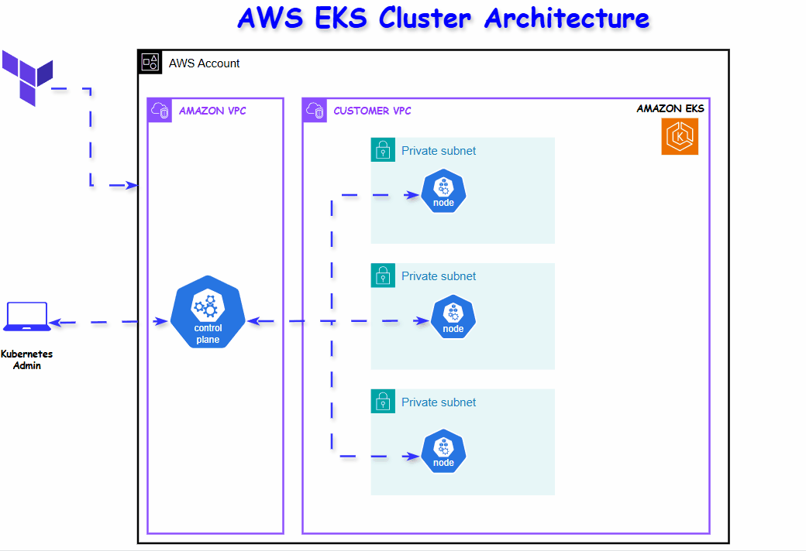

# AWS EKS Terraform Module - Production-Ready Kubernetes Cluster Infrastructure as Code

This project is a  production-ready Amazon Elastic Kubernetes Service (EKS) cluster on AWS  that was deployed using  Terraform, the widely used  (IaC) tool in cloud.This hands-on project 

## Prerequisites

This project is not begineer friendly so before you begin, ensure you have:

1. **AWS CLI** installed and configured AWS with appropriate credentials  
- Download from [Installing or updating to the latest version of the AWS CLI](https://docs.aws.amazon.com/cli/latest/userguide/getting-started-install.html)

2. **Terraform** Make sure you have terraform installed with version >= 1.0
   - Download from [Install Terraform](https://developer.hashicorp.com/terraform/install)

3. **kubectl** installed kubectl for cluster management from the official Kubernetes page
   - Download from [Install Tools](https://kubernetes.io/docs/tasks/tools/install-kubectl/)

4. **AWS IAM Permissions** - Ensure your  AWS credentials have  permissions to perform these acctions:
   - EKS cluster creation and management
   - EC2 instance and VPC management
   - IAM role creation and policy attachment
   - CloudWatch logs management


## Project Architecture and Components 


### AWS Components
The Terraform configuration creates the following AWS resources:

- **VPC with Multi-AZ Setup**: Custom VPC with public and private subnets across 4 availability zones
- **EKS Cluster**: Fully managed Kubernetes control plane with CloudWatch logging
- **Managed Node Group**: Auto-scaling worker nodes in private subnets
- **Networking**: Internet Gateway, NAT Gateways, and route tables for secure connectivity
- **Security**: Security groups with least-privilege access
- **IAM**: Service roles with required permissions for EKS cluster and worker nodes


## Executing the project

### 1. Clone and Initialize the project
First clone the project and initialze it to install all the necessory plugins,

```bash
# Clone the repository (or download the files)
git clone https://github.com/kodcapsule/terraform-aws-eks-cluster.git
cd terraform-aws-eks-cluster
terraform init
```

### 2. Configure Variables (Optional)

You can create a `terraform.tfvars` file to customize your deployment,this is optional.

Example of a terraform.tfvars
```hcl
# terraform.tfvars
cluster_name         = "my-production-cluster"
aws_region          = "us-east-1"
cluster_version     = "1.27"
node_instance_types = ["t3.large"]
node_desired_size   = 3
node_max_size       = 6
node_min_size       = 2
```


### 3. Create Remote backend Using S3 and DynamoDB

Create an S3 bucket and a DynamoDB table to manage your state. The S3 will store the `terraform.tfstate`file and the dynamoDb will be used for state locking. This is the standard practice in companies deploying production workloads. To ensure your credentials are not exposed  used terraform [Partial configuration](https://developer.hashicorp.com/terraform/language/backend). 

**Step 1 Create S3 to Store State**
```hcl
resource "aws_s3_bucket" "remote_state_bucket" {
  bucket = "${var.project_name}-state-bucket-101"

  tags = {
    Name        = "${var.project_name}-terraform-state"
    Environment = var.project_name
  }

  lifecycle {
    prevent_destroy = false
  }


}

resource "aws_s3_bucket_versioning" "remote_state_versioning" {
  bucket = aws_s3_bucket.remote_state_bucket.id

  versioning_configuration {
    status = "Enabled"
  }

}

resource "aws_s3_bucket_server_side_encryption_configuration" "dfault_encryption" {
  bucket = aws_s3_bucket.remote_state_bucket.id

  rule {
    apply_server_side_encryption_by_default {
      sse_algorithm = "AES256"
    }
  }

}

resource "aws_s3_bucket_public_access_block" "name" {
  bucket                  = aws_s3_bucket.remote_state_bucket.id
  block_public_acls       = true
  block_public_policy     = true
  ignore_public_acls      = true
  restrict_public_buckets = true

}
```
**Step 2 Create DynamoDB for State locking**

```hcl
   resource "aws_dynamodb_table" "remote_state_lock_table" {
  name         = "${var.project_name}-state-lock"
  billing_mode = "PAY_PER_REQUEST"
  hash_key     = "LockID"

  attribute {
    name = "LockID"
    type = "S"
  }

  tags = {
    Name        = "${var.project_name}-terraform-state-lock"
    Environment = var.project_name
  }

  lifecycle {
    prevent_destroy = false
  }

}
```

**3 Deploy Remote Backend  Infrastructure**

```bash

terraform fmt


terraform validate

# Review the planned changes
terraform plan
# Apply the configuration
terraform apply
```
**4 Configure  Remote Backend**

```bash
   terraform init -backend-config="./state.config"
```


### 3. Deploy the Infrastructure

```bash
# Review the planned changes
terraform plan

# Apply the configuration
terraform apply
```

The deployment typically takes between 10-15 minutes to complete.

### 4. Configure kubectl

Once the cluster is created, configure kubectl to connect:

```bash
aws eks update-kubeconfig --region <your-region> --name <your-cluster-name>

# Verify connection
kubectl get nodes
```

## Configuration Variables

| Variable | Description | Default | Type |
|----------|-------------|---------|------|
| `aws_region` | AWS region for deployment | `us-west-2` | string |
| `profile_name` | The AWS profile name to use for authentication | `default` | string |
| `project_name` | Name of the project | `aws-eks-terraform-project` | string |
| `kubernetes_version` | Kubernetes version | `1.27` | string |
| `vpc_cidr` | The CIDR block for the VPC| `10.0.0.0/16` | string |
| `node_instance_types` | EC2 instance types for nodes | `["t3.medium", "t3.large"]` | list(string) |
| `node_desired_size` | Desired number of worker nodes | `2` | number |
| `node_max_size` | Maximum number of worker nodes | `6` | number |
| `node_min_size` | Minimum number of worker nodes | `1` | number |

## Outputs

After successful deployment , you should get these outputs:

- `cluster_id`: EKS cluster identifier
- `vpc_id`: The customer managed VPC id
- `cluster_arn`: EKS cluster ARN
- `cluster_endpoint`: Kubernetes API endpoint
- `cluster_security_group_id`: Security group ID for the cluster
- `kubectl_config`: Configuration details for kubectl setup

## Verify Deployment

```bash
# Check cluster status
kubectl get nodes

# View cluster info
kubectl cluster-info

# Check system pods
kubectl get pods -n kube-system
```

## Post-Deployment Setup

### Install Essential Add-ons

1. **AWS Load Balancer Controller** (for ingress):
   ```bash
   helm repo add eks https://aws.github.io/eks-charts
   helm install aws-load-balancer-controller eks/aws-load-balancer-controller \
     -n kube-system \
     --set clusterName=<your-cluster-name>
   ```

2. **Cluster Autoscaler**:
   ```bash
   kubectl apply -f https://raw.githubusercontent.com/kubernetes/autoscaler/master/cluster-autoscaler/cloudprovider/aws/examples/cluster-autoscaler-autodiscover.yaml
   ```

3. **Metrics Server** (if not already installed):
   ```bash
   kubectl apply -f https://github.com/kubernetes-sigs/metrics-server/releases/latest/download/components.yaml
   ```


## Security and Cost Optimization Considerations

### Security 
This configuration implements several security best practices:

- **Private Worker Nodes**: All worker nodes are deployed in private subnets
- **Network Isolation**: Proper security group rules limit access
- **IAM Least Privilege**: Minimal required permissions for cluster and nodes
- **Encrypted Communication**: All traffic between components is encrypted
- **CloudWatch Logging**: Comprehensive audit logging enabled

### Cost Optimization

To optimize costs:

1. **Right-size instances**: Choose appropriate instance types for your workload
2. **Use Spot Instances**: Consider spot instances for non-critical workloads
3. **Enable Cluster Autoscaler**: Automatically scale nodes based on demand
4. **Monitor usage**: Use AWS Cost Explorer to track EKS costs

## Troubleshooting

### Common Issues

1. **Authentication Error**:
   ```bash
   # Re-configure kubectl
   aws eks update-kubeconfig --region <region> --name <cluster-name>
   ```

2. **Nodes Not Joining**:
   - Check IAM roles and policies
   - Verify security group rules
   - Check subnet routing

3. **Terraform Apply Fails**:
   - Ensure AWS credentials are configured
   - Check IAM permissions
   - Verify resource limits in AWS account

### Useful Commands

```bash
# View Terraform state
terraform show

# Get specific output
terraform output cluster_endpoint

# Destroy infrastructure (caution!)
terraform destroy
```

## Maintenance

### Upgrading Kubernetes Version

1. Update the `cluster_version` variable
2. Apply changes: `terraform apply`
3. Update node groups following AWS documentation

### Scaling Nodes

Modify the scaling variables in `terraform.tfvars` and apply:
```bash
terraform apply
```

## Contributing

1. Fork the repository
2. Create a feature branch
3. Make your changes
4. Test thoroughly
5. Submit a pull request


## Support

For issues and questions:
- Check the [troubleshooting section](#troubleshooting)
- Review [AWS EKS documentation](https://docs.aws.amazon.com/eks/)
- Open an issue in this repository

## Additional Resources

- [AWS EKS Best Practices Guide](https://aws.github.io/aws-eks-best-practices/)
- [Terraform AWS Provider Documentation](https://registry.terraform.io/providers/hashicorp/aws/latest/docs)
- [Kubernetes Documentation](https://kubernetes.io/docs/)
- [AWS EKS Workshop](https://www.eksworkshop.com/)